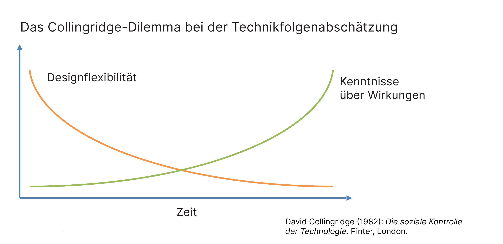
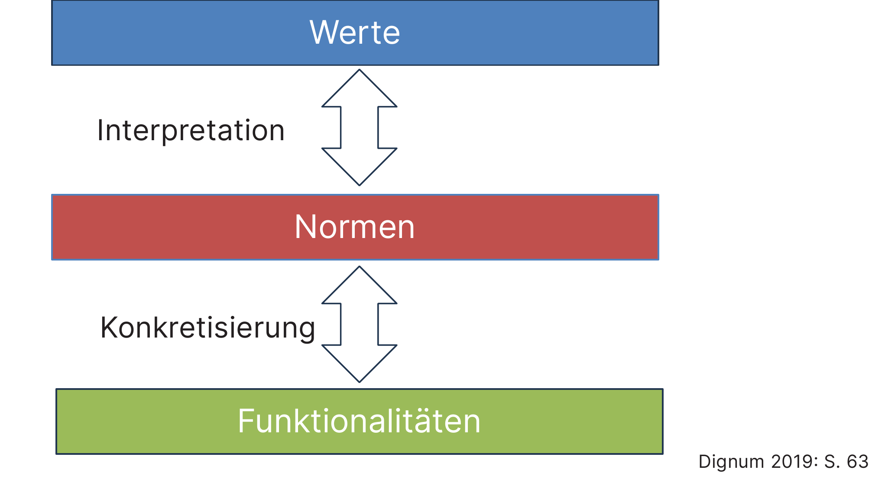
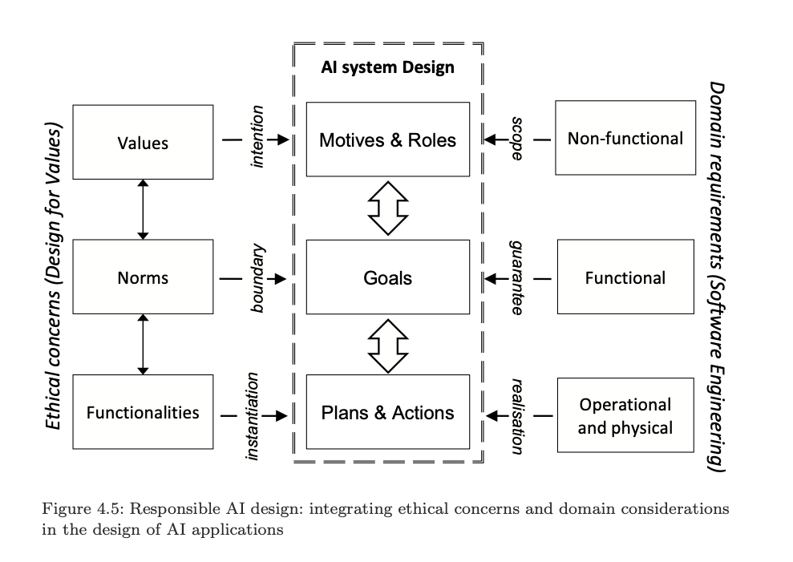
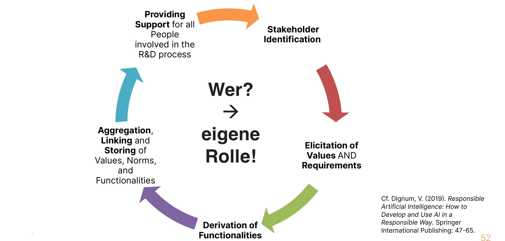

Dieses Skript begleitet die erste Lerneinheit der Veranstaltung "Governance, Risk, Compliance & Ethics – Teil 2". Es legt das ethische Fundament, auf dem die folgenden rechtlichen Einheiten zum Datenschutz- und Informationssicherheitsrecht aufbauen. Ziel ist nicht, Sie zu Moralphilosophinnen und -philosophen auszubilden, sondern Ihnen ein Werkzeug an die Hand zu geben, mit dem Sie ethische Anforderungen an digitale Systeme mit Sicherheitsrelevanz erkennen, begründen und in Arbeitsprozesse einfügen können.

## Was ist Ethik? Grundbegriffe und drei Denkschulen

### Ethik, Moral und das richtige Handeln

Der Begriff *Ethik* leitet sich vom altgriechischen *ethos* (Sitte) ab, ist mit diesem aber nicht identisch. Ethik ist die **Lehre vom richtigen Handeln** – die systematische, wissenschaftliche Auseinandersetzung mit der großen Frage, „was gut und richtig ist" bzw. „wie wir handeln sollten". Während die *Moral* den tatsächlich gelebten Bestand an Wertvorstellungen einer Gruppe bezeichnet, fragt die Ethik als philosophische Disziplin nach der **Begründung** dieser Vorstellungen. Sie liefert keine fertigen Antworten, sondern Verfahren, mit denen sich Antworten rechtfertigen lassen.

Für die Informationssicherheit ist dieser Perspektivwechsel entscheidend: Technische Systeme treffen oder unterstützen Entscheidungen, die Menschen betreffen. Die Frage, ob ein System „sicher" ist, lässt sich technisch beantworten – die Frage, ob sein Einsatz *richtig* ist, nicht.

::: {.flip-card}
#### Ethik vs. Moral
Moral ist der gelebte Bestand an Wertvorstellungen einer Gruppe; Ethik ist die wissenschaftliche Reflexion über deren Begründung und Geltung.
:::

### Werte, Prinzipien, Normen – eine Begriffsleiter

Ethische Grundbegriffe bauen aufeinander auf. **Werte** sind handlungsleitende Orientierungsmaßstäbe; nach herrschender Auffassung sind sie keine Eigenschaften von Sachverhalten, sondern Geltungsansprüche, die ein Mensch erhebt Der ethische Wertbegriff ist zudem vom ökonomischen Tauschwert abzugrenzen. Ethisch ist eine Entscheidung nicht unbedingt, nur weil sie profitabel im ökonomischen Sinne ist.

**Prinzipien** verbinden einen Wert mit einer ersten Sollensaussage: „Wert X soll sein." So fordert etwa die Menschenwürde, jeden Menschen respektvoll zu behandeln. 

**Normen** schließlich sind mehr oder weniger verbindliche Sollensätze für eine Gruppe – sie reichen von Brauch und Sitte über die Moral bis zum Recht. Werden Prinzipien für ihre Adressatinnen und Adressaten konkret, spricht man auch von **Regeln**. Normen können auf Prinzipien und darüber wiederum auf Werte zurückgeführt werden, müssen es aber nicht. So ist etwa DIN A4 eine Norm, aber ein ethischer Wert lässt sich dahinter nur schwer erkennen.

::: {.drag-exercise}
Ein *Wert* ist ein handlungsleitender Orientierungsmaßstab, ein *Prinzip* verbindet ihn mit einer ersten Sollensaussage, und eine konkrete, adressatenbezogene Verhaltensnorm nennt man *Regel*.
:::

### Die drei Grundströmungen der Ethik

Die abendländische Ethik kennt drei große Denkschulen, die sich darin unterscheiden, *woran* sie das richtige Handeln messen.

Die **Tugendethik** (auch "Gesinnungsethik") fragt nach der Übereinstimmung der Handlungs*intention* und des Charakters mit bestimmten Werten. Ihr Ziel ist das gute, gelingende Leben. Bei *Platon* sind die Kardinaltugenden (Weisheit, Tapferkeit, Besonnenheit, Gerechtigkeit) in einem Ordnungsmodell von Seele, Tugenden und Ständen verankert. *Aristoteles* unterscheidet dianoëtische (Erkenntnis-) und ethische (Willens-)Tugenden; für letztere gilt das **Prinzip der Mitte** zwischen zwei Lastern. *Thomas von Aquin* ergänzt die durch die Offenbarung der Bibel bekannten religiösen Tugendne (Glaube, Liebe, Hoffnung) um die natürlichen, durch Vernunft erkennbaren Tugenden.

Der **Utilitarismus** (eine Form der Verantwortungs- bzw. Folgenethik) misst Handlungen dagegen an ihren *Folgen*: Richtig ist, was die Nützlichkeit (*utility*) für möglichst viele maximiert. Der Nutzen kann materieller Vorteil, aber auch Freude oder Vermeidung von Leid sein; die Interessen aller zählen grundsätzlich gleich, auch die eigenen Interessen zählen nicht mehr – der Utilitarismus ist also **keine egoistische Lehre**.

Die **Pflichtenethik** Immanuel *Kants* schließlich begründet das Sollen allein aus der praktischen Vernunft. Der Mensch kann sich kraft seines Willens selbst Pflichten auferlegen (**Autonomie**). Den inhaltlichen Maßstab liefert der **kategorische Imperativ**, etwa in der Universalisierungsformel („Handle nur nach derjenigen Maxime, durch die du zugleich wollen kannst, dass sie ein allgemeines Gesetz werde") und in der Zweck-an-sich-Formel (den Menschen nie bloß als Mittel zu gebrauchen).

Erkunden Sie im folgenden Widget, wie die drei Denkschulen dasselbe Sicherheits-Dilemma jeweils unterschiedlich bewerten.

::: {.widget}
<iframe src="widgets/kapitel-01/widget-ethik-schulen.html" width="100%" height="520px" frameborder="0" title="Drei Ethik-Schulen im Vergleich"></iframe>
:::

::: {.quick-check}
Eine Sicherheitsverantwortliche entscheidet sich, eine Schwachstelle offenzulegen, weil daraus „in Summe der größtmögliche Nutzen für alle Betroffenen" entstehe. Welcher Denkschule folgt sie?

- Tugendethik
- **Utilitarismus**
- Pflichtenethik
- Maschinenethik
:::

Die drei Schulen sind keine sich ausschließenden Lager. In der Praxis liefern sie drei komplementäre **Daumenregeln**: tugendhaft zu handeln, den größtmöglichen Nutzen zu stiften und den nach Verfahrensregeln gewonnenen Pflichten zu folgen.

## Sicherheit als Wert und Prinzip

### Warum Sicherheit ein ethischer Grundwert ist

Sicherheit lässt sich aus allen drei Denkschulen heraus begründen. Gesinnungsethisch ist die Gewährleistung von Sicherheit für die Menschen im eigenen Einflussbereich eine gut begründbare Tugend. Utilitaristisch kommt Sicherheit potenziell allen zugute und kann hohe Kosten Einzelner aufwiegen. Pflichtenethisch ist Sicherheit ein **Grundwert**, weil ohne sie andere Werte wie Freiheit und Selbstbestimmung gar nicht erst realisiert werden können. Schon Thomas *Hobbes* beschreibt im „Leviathan" (1651) – vor dem Hintergrund des englischen Bürgerkriegs – den Naturzustand als „Krieg aller gegen alle" und macht die Sicherheitsgewährleistung zum Gründungszweck des Staates.

Diese Stützfunktion macht Sicherheit aber nicht zum absoluten Wert. Genau hier beginnt die ethische Arbeit: das Abwägen zwischen Sicherheit und konkurrierenden Werten.

### Fallstudie: Das Luftsicherheitsgesetz vor dem Bundesverfassungsgericht

::: {.case-study}
#### Darf der Staat ein entführtes Flugzeug abschießen?
Nach den Anschlägen vom 11. September 2001 ermächtigte [§ 14 Abs. 3 des Luftsicherheitsgesetzes](https://www.gesetze-im-internet.de/luftsig/__14.html){target="_blank"} die Bundeswehr, ein Flugzeug abzuschießen, das als Waffe gegen Menschenleben eingesetzt werden soll. Die strenge Umsetzung des Prinzips „Sicherheit" hätte zur Folge, dass die unschuldigen Passagiere getötet würden, um eine größere Zahl von Menschen am Boden zu retten – eine geradezu klassische utilitaristische Kalkulation. Ist diese Regel ethisch und verfassungsrechtlich haltbar?

::: {.solution}
Das Bundesverfassungsgericht erklärte die Abschussermächtigung für **nichtig**. Die gezielte Tötung der Passagiere mache diese zum bloßen *Objekt* staatlichen Handelns und verletze damit ihre Menschenwürde aus [Art. 1 Abs. 1 GG](https://www.gesetze-im-internet.de/gg/art_1.html){target="_blank"} in Verbindung mit dem Recht auf Leben ([Art. 2 Abs. 2 S. 1 GG](https://www.gesetze-im-internet.de/gg/art_2.html){target="_blank"}). Hier wird die kantische Pflichtenethik (der Mensch darf nie bloß Mittel sein) verfassungsrechtlich wirksam und setzt der utilitaristischen Nutzenrechnung eine absolute Grenze. Die Entscheidung zeigt: Sicherheit ist ein hoher, aber kein schrankenloser Wert.

>BVerfG, Urt. v. 15.02.2006 – 1 BvR 357/05 → Luftsicherheitsgesetz ([§ 14 Abs. 3 LuftSiG](https://www.gesetze-im-internet.de/luftsig/__14.html){target="_blank"} nichtig)
:::
:::

## Ethische Perspektiven auf digitale Systeme

### Handeln Maschinen? Die Heider-Simmel-Intuition

Schauen Sie erst das Video, lesen Sie dann weiter:

Was haben Sie hier gesehen? Wahrscheinlich eine Verfolgung, spielende Kinder oder einen Familienstreit. Das Faszinierende daran: Hier bewegten sich doch eigentlich nur geometrische Figuren. Die Psychologen Fritz Heider und Marianne Simmel zeigten bereits 1944, dass Menschen bewegten geometrischen Figuren spontan Absichten, Gefühle und „Handlungen" zuschreiben. Diese Neigung prägt unsere Alltagssprache: Wir sagen „Siri macht dies und das" und behandeln KI sprachlich als Akteur. Digitale Systeme übernehmen zunehmend Aufgaben mit sozialen Folgen – Kreditscoring, Fahrzeugsteuerung, Content-Empfehlung. Daraus erwächst die Frage nach der **Handlungsfähigkeit („Agency")** technischer Systeme und ihren moralischen Konsequenzen. Um diese besser beurteilen zu können, müssen wir jetzt drei Grundbegriffe klären.

### Moralischer Status, Patient und Agent

Drei Begriffe ordnen ethsiche Debatten: Der **moralische Status** bezeichnet die Eigenschaft einer Entität, überhaupt moralisch betrachtet werden zu können – also richtig oder falsch behandelt werden zu können. Ein **moralischer Patient** ist eine Entität mit moralischem Status, die von einer Handlung betroffen ist. Ein **moralischer Agent** ist eine Entität, die in der Lage ist, moralisch zu handeln und dafür Verantwortung zu tragen.

Können digitale Systeme moralische Patienten sein? Manche Stimmen befürworten eine „technologische Person" mit eigenen Rechten – bisher hat der Gesetzgeber aber den Vorschlag einer „electronic personhood" jedoch nicht aufgegriffen. Können sie moralische Agenten sein? Luciano *Floridi* und J. W. Sanders argumentieren mit ihrer Analyse über *Levels of Abstraction*, dass künstliche Agenten **moralisch zurechenbar** (*accountable*) handeln können, ohne deshalb **moralisch verantwortlich** (*responsible*) zu sein – letzteres setzt mentale Zustände voraus, die Maschinen fehlen.

::: {.flip-card}
#### Moralischer Patient vs. moralischer Agent
Ein moralischer Patient *erleidet* moralisch relevante Handlungen; ein moralischer Agent *vollzieht* sie und trägt dafür Verantwortung.
:::

### Verantwortung – und warum KI sie (noch) nicht trägt

**Verantwortung** bedeutet, für die Folgen eigener oder fremder Handlungen Rechenschaft ablegen zu können und zu müssen. Schon Aristoteles nennt dafür zwei Bedingungen: 
1. die **Kontroll-Bedingung** (X verursacht die Handlung oder hat hinreichende Kontrolle) und 
2. die **epistemische Bedingung** (X handelt bewusst, nicht aus selbstverschuldeter Unwissenheit). Beide sind eng an Willensfreiheit und Absicht gebunden.

Hieraus folgt für den heutigen Stand der Technik: Es ergibt keinen Sinn, von KI freiwilliges Handeln zu verlangen, weil sie keinen eigenen Willen und kein Bewusstsein hat. KI kann zwar *handeln*, ist aber **kein moralischer Akteur** im vollen Sinne. Genau diese Lücke zwischen technischer Verursachung und menschlicher Zurechnung beschreibt die **Responsibility Gap** (Matthias 2004): Der Entwickler kann das System nicht vollständig vorhersehen, der Betreiber es nicht vollständig durchschauen, die Nutzerin hat die Entscheidung delegiert.

::: {.quick-check}
Warum ist eine KI nach aristotelischem Verständnis kein vollwertiger moralischer Agent?

- Weil sie technisch nicht zuverlässig genug ist
- **Weil ihr Willensfreiheit und Bewusstsein fehlen (Kontroll- und epistemische Bedingung)**
- Weil sie keine Fehler macht
- Weil sie nicht autonom handeln kann
:::

## Ethik im Entwicklungsprozess: Standards für „Responsible AI"

### Das Collingridge-Dilemma

Warum muss ethische Bewertung bereits *während* der Entwicklung stattfinden? David Collingridge (1980) formulierte das nach ihm benannte Dilemma: In frühen Entwicklungsphasen ist die **Designflexibilität** hoch, aber das **Wissen über die Wirkungen** der Technik gering; in späten Phasen kennen wir die Wirkungen einer Technik auf die Gesellschaft, können die Systeme aber kaum noch ändern, weil wir bestimmte Funktionen erwarten und die Technik in bestehende Prozesse fest implementiert ist. Eine rein nachträgliche Regulierung kommt deshalb systematisch zu spät. Daraus folgt das Gebot, ethische Richtlinien und Bewertungsverfahren **von Anfang an** für alle Beteiligten verbindlich zu machen.

### Dignum: ART und wertorientiertes Design

Virginia *Dignum* (2019) verlangt, KI-Systeme schon in frühen Stadien als sozial relevante Systeme zu behandeln. Ihr Leitprinzip ist **ART**: **A**ccountability (Rechenschaft), **R**esponsibility (Verantwortung) und **T**ransparency (Transparenz). Im Rahmen *Responsible Research and Innovation* (RRI) sollen alle relevanten Stakeholder in einen offenen Entwicklungsprozess eingebunden werden. Das folgende Modell zeigt, wie ethische Anforderungen (Werte → Normen → Funktionalitäten) systematisch mit dem technischen Systemdesign verknüpft werden:

Die **grundlegende Prozessstruktur** umfasst fünf Schritte:
1. Identifizierung der relevanten Stakeholder,
2. Ermittlung der Werte und Anforderungen aller Beteiligten (z. B. in Workshops),
3. Aggregation der Werte und Wertinterpretationen,
4. Festhalten formaler Verbindungen zwischen Werten, Normen und Systemfunktionen, um das System an sich entwickelnde Wahrnehmungen anpassbar zu halten,
5. Unterstützung aller am Entwicklungsprozess Beteiligten bei der Auswahl von Systemkomponenten anhand ihrer zugrunde liegenden gesellschaftlichen und ethischen Vorstellungen.

### Industriestandards: Die IEEE-7000-Familie

Das wertorientierte Design ist heute in **Industriestandards** kodifiziert. Über das IEEE GET Program frei zugänglich, adressiert insbesondere die IEEE-7000-Reihe ethische Anliegen im Systemdesign: **IEEE 7000-2021** (Modellprozess für ethische Belange im Systemdesign), **7001** (Transparenz autonomer Systeme), **7002** (Datenschutz-Prozess) und **2089** (altersgerechte digitale Dienste nach den 5Rights-Prinzipien). Diese Standards übersetzen die abstrakten Prinzipien in prüfbare Prozessanforderungen – und schlagen damit die Brücke zu den Compliance-Pflichten, die uns in den folgenden Einheiten begegnen.

::: {.case-study}
#### Übung: Werte in der eigenen Praxis
Wählen Sie ein digitales System mit Sicherheitsrelevanz, das Sie kennen (z. B. ein Zugangskontroll-, Monitoring- oder KI-Assistenzsystem). Benennen Sie zwei Werte, die in Konflikt geraten könnten (etwa Sicherheit vs. Privatheit), und ordnen Sie sie nach dem Dignum-Schema einer Funktionalität zu.

::: {.solution}
Beispiel: Ein KI-gestütztes Anomalie-Erkennungssystem im Netzwerk verfolgt den Wert *Sicherheit* (Norm: Bedrohungen früh erkennen → Funktionalität: Logfile-Analyse), kollidiert aber potenziell mit dem Wert *Privatheit der Beschäftigten* (Norm: Datenminimierung → Funktionalität: Pseudonymisierung der Logs). Das ART-Prinzip verlangt, diesen Zielkonflikt transparent zu dokumentieren, die Verantwortlichkeiten zu klären und eine rechenschaftsfähige Abwägung zu treffen – idealerweise unter Einbindung der betroffenen Stakeholder.
:::
:::

Damit ist das Fundament gelegt: Wir haben Werkzeuge, um ethische Anforderungen an sicherheitsrelevante Systeme zu erkennen und zu begründen. Die folgende erste Einheit zum **Datenschutzrecht** wird zeigen, wie das Recht den Wert der informationellen Selbstbestimmung in durchsetzbare Pflichten übersetzt.

## Quellen

### Literatur

- Collingridge, D. (1980): *The Social Control of Technology*. Frances Pinter, London.
- Dignum, V. (2019): *Responsible Artificial Intelligence: How to Develop and Use AI in a Responsible Way* (Reihe: Artificial Intelligence: Foundations, Theory, and Algorithms). Springer International Publishing, Cham. <https://doi.org/10.1007/978-3-030-30371-6>
- Floridi, L. & Sanders, J. W. (2004): On the Morality of Artificial Agents. *Minds and Machines* 14, S. 349–379.
- Heider, F. & Simmel, M. (1944): An Experimental Study of Apparent Behavior. *The American Journal of Psychology* 57 (2), S. 243–259.
- Matthias, A. (2004): The Responsibility Gap: Ascribing Responsibility for the Actions of Learning Automata. *Ethics and Information Technology* 6 (3), S. 175–183.

### Normen & Standards

- IEEE 7000-2021 – Model Process for Addressing Ethical Concerns during System Design
- IEEE 7001-2021 - Transparency of Autonomous Systems
- IEEE 7002-2022 - Data Privacy Process
- IEEE 2089-2021 - Age Appropriate Digital Services Framework

### Rechtsprechung

- BVerfG, Urteil vom 15.02.2006 – 1 BvR 357/05 (Luftsicherheitsgesetz), BVerfGE 115, 118.
